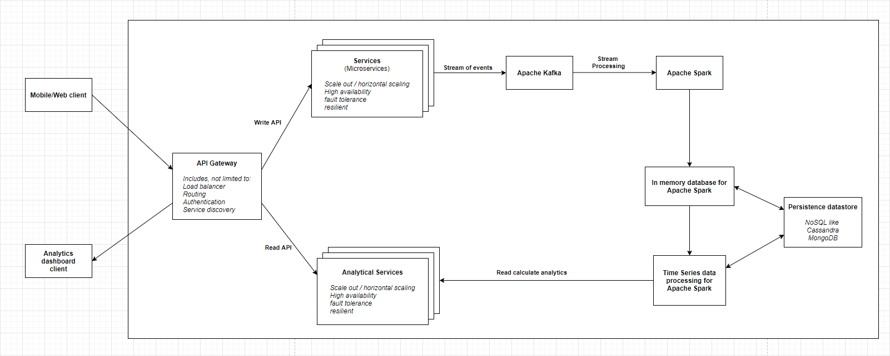

# Google Analytics System Design

 
## System Description 

- Google Analytics system tracks user analytics and captures in the system so that customers can view analytics built on top of that. 
- As shown in architecture, client (mobile/web) will be sending tracking information to API Gateway. 
- API Gateway do the necessary administration activities like authentication, load balancing, service discovery and routing to correct (write) service.
- Write service will capture the information and forward that to Apache Kafka. 
- Apache Kafka need to have topics configured already on which this data can be received. 
- Apache Spark will subscribe to these topics and will do the necessary transformation to process the information. 
- This processed and transformed events will be fed into In-memory distributed cache which can be a write-back cache.
- It will cache the recent published tracking events that can be consumed by Spark timeseries processing engine.
- In-memory distributed cache will write the data to the data store.
- Spark timeseries processing engine will be producing real-time analytics. Also, it can create historical analytics as well by reading data from NoSQL datastore
- When user requests analytics reports, read service will read the information produced by Apache Spark data processing component and will be shown to the user dashboard.

## Component Description 

### Web/Mobile Client 
- User will be tracked based on browser cookies assigned.

### API Gateway 
- API Gateway is a system component that is the entry point in the system.
- It can provide load balancing aspect, which is to route traffic to appropriate handlers based on request.
- It takes care of authentication aspect.
- It also does service discovery; service discovery may require additional plugins to be integrated based on the API gateway chosen for implementation

### Write API Service 
- Write API will record the statistics in the platform. 
- Services are scalable, resilient, fault-tolerant and highly available.
- Individual services can further be deployed using Docker containers in Docker Swarm or Kubernetes cluster
- Can use Spring boot for microservices.

### Apache Kafka 
- Apache Kafka is real-time streaming platform that helps to create efficient data pipelines. 
- Will be publishing user tracking events to Kafka that it will stream for consumption. 
- Consumers can subscribe to these topics for processing the events. 
- Kafka is highly scalable, fault-tolerant and very mature messaging system. 

### Apache Spark 
- Spark enables processing of live data streams.
- Spark is a perfect choice for the architecture because it provides high performance for both batch and streaming data.

### Distributed Cache/In memory data store 
- To provide high performance for calculating analytics, an in-memory data store is preferable.
- A write-back cache policy can be adopted to make sure as soon as an event is read, it’s kept in cache and then lazily updated in the data-store.
- Main advantage of having this in memory data store is to reduce database calls to read the tracking information 
- In case of Spark failover Analytics engine still can be resilient to calculate the analytics.
- Redis can be used for this purpose.

### Persistent Data store 
- To store user tracking information a NoSQL database is wise choice as it allows the flexibility to store data in any format.
- Also, with rapidly changing business requirements, NoSQL databases are capable of adopting the change as they are scalable and flexible
- Apache Cassandra, MongoDB are some of the best suited databases for Enterprise level. 

### Spark Timeseries Data Processing 
- Calculates and stores the real time analytics for user presentation.
- Also, calculate on demand historical analytics from the data store.

### Analytics Dashboard 
- There are multiple tools to show analytics. Like Tableau.
- Modern web-based analytics dashboards are present for customers to view on their website.
